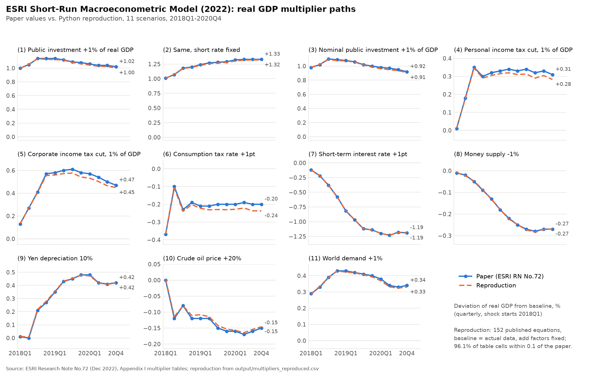
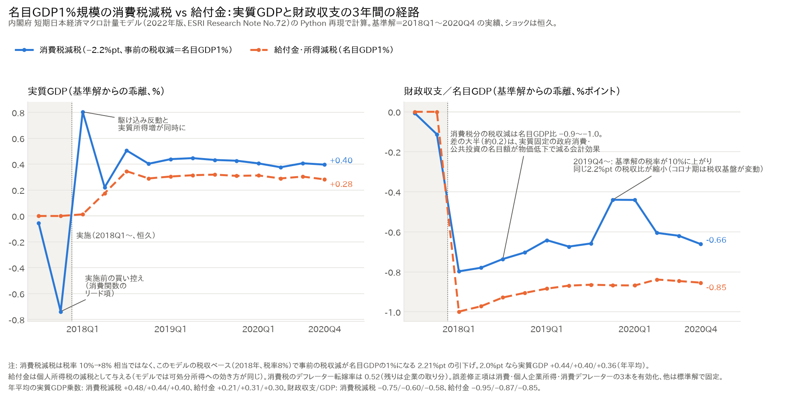
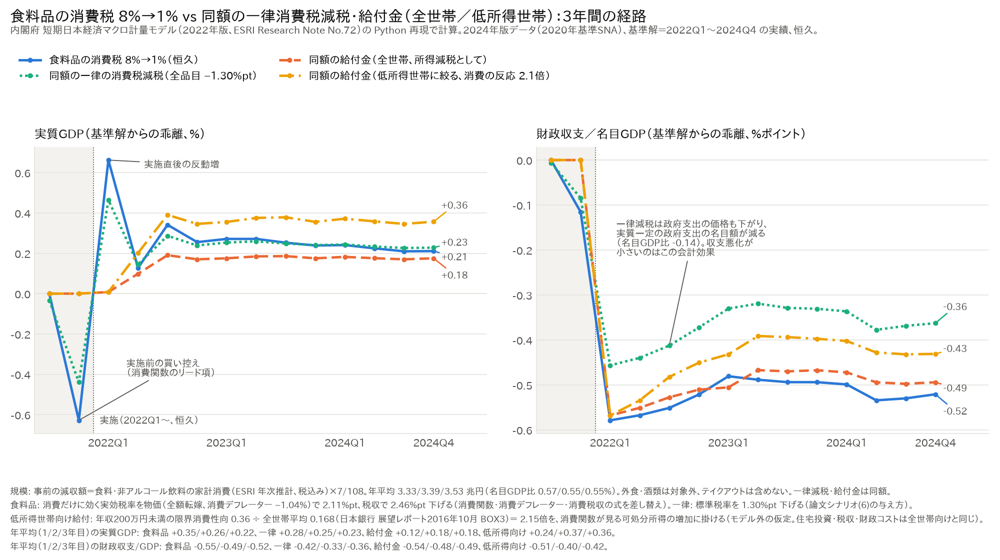
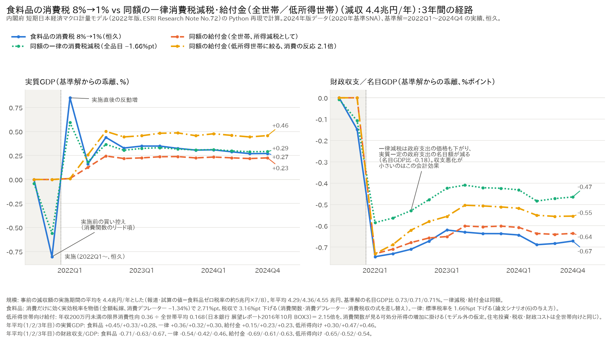
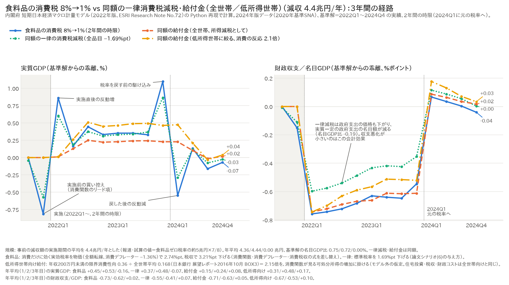

# 短期日本経済マクロ計量モデル（2022年版）の Python 再現

内閣府経済社会総合研究所（ESRI）「短期日本経済マクロ計量モデル（2022年版）の構造と乗数分析」
（ESRI Research Note No.72, 2022年12月）に掲載された **152本の方程式を公表係数のまま実装**し、
2018Q1〜2020Q4 の標準解（実績値）に対する **11種類の乗数シミュレーション** を再現する。

原典: [ESRI Research Note No.72（PDF）](https://www.esri.cao.go.jp/jp/esri/archive/e_rnote/e_rnote080/e_rnote072.pdf)
（論文は同梱していない。`src/fetch_paper.py` で取得する）

> 本リポジトリは個人による再現の試みであり、内閣府・ESRI とは関係ありません。

## 実行手順

```bash
pip install -r requirements.txt
python src/fetch_paper.py      # 論文PDFを取得しテキスト抽出 → reference/
python src/published.py        # 論文の乗数詳細表 → output/published_multipliers.csv
python src/simulate.py         # 11シナリオ → output/multipliers_reproduced.csv, multipliers_comparison.csv
python src/simulate.py --ecm live   # 比較用: 誤差修正項をすべて動かす（出力に _ecmlive が付く）
python src/simulate.py --itr level  # 比較用: 式129を論文の印刷どおりの水準式にする（出力に _itrlevel が付く）
python src/check_transcription.py   # 152本の係数・定数を論文と機械照合
python src/ledger.py           # 変数台帳（論文の定義と実際の系列の突き合わせ・検査）→ data/processed/variable_ledger.csv
python src/plot_multipliers.py # 実質GDP乗数の経路図 → output/gdp_multiplier_paths.png
python src/plot_tax_cut_vs_benefit.py # 消費税減税 vs 給付金（GDP1%規模）の経路図 → output/tax_cut_vs_benefit.png
python src/plot_food_tax_cut_vs_benefit.py # 食料品の消費税 8%→1% vs 同額の給付金（2024年版）→ output/food_tax_cut_vs_benefit.png
```

モデル用データ（`data/processed/model_data.csv`）は同梱しているので、上の手順だけで乗数を再現できる。
データを作り直す場合は次を実行する。

```bash
python src/fetch_boj.py        # 日銀API（為替・CDレート・M2・企業物価・資金循環）
python src/fetch_external.py   # ESRI景気動向指数（TOPIX・10年国債）、OECD（米国金利・物価・GDP）
python src/sna.py              # ESRI 2015年基準SNA → data/processed/sna_*.csv
python src/build_data.py       # モデル用四半期データ → data/processed/model_data.csv, data_notes.csv
```

### データの版（vintage）

`src/vintage.py` で切り替える。環境変数 `ESRI_VINTAGE` を付けると、データの作成・台帳・乗数計算がすべてその版で動き、出力ファイルにサフィックスが付く。

| `ESRI_VINTAGE` | 内容 | 期間 | 用途 |
|---|---|---|---|
| （既定） | 論文と同じ版: 2021年10-12月期2次QE + 2020年度年次推計（2015年基準） | 2010Q1〜2021Q4 | **論文の乗数表との照合**。式や実装を変えたときは必ずこの版で一致率を確認する |
| `2024` | 2026年4-6月期2次QE（2020年基準）+ 2024年度年次推計 | 2010Q1〜2024Q4 | **最近の経済での分析**。基準解を 2022〜2024年に置いて乗数や反実仮想を計算する |
| `2025` | 2025年4-6月期2次QE + 2022年度年次推計 | 2010Q1〜2021Q4 | 版の違いによる感応度の確認（2024年版に置き換わる予定） |

```bash
# 2024年版でデータを作り直し、2022Q1〜2024Q4 を基準解にして11シナリオを解く
ESRI_VINTAGE=2024 python src/fetch_sna.py     # ESRI から QE と年次推計の表を data/raw/vintage2024/ に取得
ESTAT_APP_ID=<your id> python src/fetch_estat.py  # e-Stat: 稼働率（2020年基準）、貿易統計 2021〜25年
python src/fetch_external.py --fred            # FRED: 米国製造業PPI（OECD の系列が2022年で終了したため）
ESRI_VINTAGE=2024 python src/sna.py && ESRI_VINTAGE=2024 python src/build_data.py
ESRI_VINTAGE=2024 python src/ledger.py
ESRI_VINTAGE=2024 python src/simulate.py --start 2022Q1 --end 2024Q4   # → output/multipliers_reproduced_v2024_2022Q1_2024Q4.csv
ESRI_VINTAGE=2024 python src/simulate.py                                # 論文期間で解いた場合（一致率 93.6%、データ改定と基準年変更の影響）
```

2024年版で追加・変更したデータ: 労働力調査は長期時系列表1-a-1（2026年7月分まで）、稼働率指数は2020年基準を2015年基準に重複期間の平均比で接続、貿易統計は2021〜2025年の表を追加、米国PPI（`US_WPI` と競争国価格の代理 `WD_PX`・`WD_PI`）は FRED の製造業PPIに置換。詳細は `data/processed/variable_ledger_v2024.csv`。
消費税率のリード項（2期先）のため、`simulate.py` はデータ末尾の2期先まで税率を前方補填して解く。
論文と同じ版の e-Stat 由来の生データ（労働力調査、稼働率指数、貿易統計、毎月勤労統計）と ESRI の SNA ファイルは、
`data/raw/` に取得済みのものを同梱している（下記「データの出典と利用条件」）。2024年版で追加した分は `src/fetch_sna.py`（ESRI）、`src/fetch_estat.py`（e-Stat API）、`src/fetch_external.py --fred`（FRED）で取得できる。

## ファイル構成

| ファイル | 内容 |
|---|---|
| `src/model.py` | 152本の方程式、暦・ダミー変数、誤差項計算、ガウス＝ザイデル・ソルバー |
| `src/ecm.py` | 誤差修正項の定義、標準解での固定、切り出しの検査（`check_separation`） |
| `src/simulate.py` | 論文の11シナリオの定義と乗数の計算・比較 |
| `src/vintage.py` | SNA データの版（論文と同じ2021年版／2025年版）の切り替え |
| `src/build_data.py` | 各統計からモデル変数を作成（代用・仮定は `data_notes.csv` に記録） |
| `src/ledger.py` | 変数台帳の作成と検査（論文付属資料IIの定義・単位・出所と、実際の系列・加工・単位換算・欠損処理の突き合わせ） |
| `src/plot_multipliers.py` | 実質GDP乗数の四半期経路（論文 vs 再現、11シナリオ）の作図 |
| `src/plot_tax_cut_vs_benefit.py` | 名目GDP1%規模の消費税減税 vs 給付金の実質GDP・財政収支/GDP の3年間経路（`output/tax_cut_vs_benefit.{csv,png}`） |
| `src/plot_food_tax_cut_vs_benefit.py` | 食料品の消費税 8%→1% vs 同額の一律消費税減税・給付金（2024年版、2022〜24年基準）。減収額は ESRI 家計の目的別消費の食料・非アルコール飲料×7/108、消費だけに効く税率で消費関数・消費デフレーター・消費税収の式を差し替え（`output/food_tax_cut_vs_benefit.{csv,png}`） |
| `src/sna.py` | SNA 四半期速報・年次推計の読み込み、季節調整（移動平均比率法） |
| `src/fetch_*.py` | 論文・日銀・ESRI景気動向指数・OECD・FRED からの取得。`fetch_sna.py` は版の SNA ファイル、`fetch_estat.py` は e-Stat API（稼働率・貿易統計） |
| `src/experiment_ecm*.py` | 誤差修正項の扱いを特定した検証実験（結果は `output/experiment_ecm*.csv`） |
| `src/experiment_ucc.py` | 法人税減税シナリオの資本コスト `UCC` の寄与分解と感応度（Issue #1、結果は `output/experiment_ucc*.csv`） |
| `src/check_transcription.py` | 論文の各式の係数・定数と `model.py` の機械照合 |
| `src/experiment_fidelity.py` | 印刷どおり・別解釈・誤植修正前の式で解いた一致度（`docs/fidelity.md`、結果は `output/experiment_fidelity.csv`） |
| `src/experiment_ecm_greedy.py` | 誤差修正項の固定の探索（1本ずつ固定、貪欲法、入れ子形の追加3本） |
| `docs/fidelity.md` | 論文への忠実性の監査（照合方法、誤植の根拠、逸脱2件の根拠と影響） |

## 再現の考え方

- **標準解＝実績値**: 各式に実績から逆算した誤差項（論文の `CERR*ERTS_xx`）を加える。標準解の再現誤差は 1e-14 程度。
- **乗数**: ショック解 − 標準解。年乗数は四半期の単純平均（論文と同じ）。解く期間は 2017Q3〜2020Q4（消費税率のリード項が2017Q3〜Q4に効くため）、表示は 2018Q1〜2020Q4。
- **データの版**: 論文が使った **2021年10-12月期2次QE（2022年3月公表）＋2020年度年次推計** に揃える。公共投資乗数から逆算した IG/GDP 比が、この版と 0.001%pt で一致する（2025年版では最大 0.04%pt ずれる）。
- **誤差修正項**: 消費・個人企業所得・消費デフレーターの3本だけ動かし、他の11本は標準解の値で固定する（下記）。

## 論文への忠実性

152本の式の係数・定数は `src/check_transcription.py` で論文と機械照合し、すべて一致する。印刷と違う扱いをしているのは、誤植の修正7件（`model.py` の `[fix]`）を除くと次の2点だけで、どちらも印刷どおりに切り替えられる。

| 逸脱 | 既定 | 印刷どおりにする | 印刷どおりの一致率 |
|---|---|---|---|
| 式129 所得実効税率の型 | DLOG型 | `python src/simulate.py --itr level` | 95.3%（実質GDPの誤差はむしろ小さい。個人所得税の経路が合わない） |
| 誤差修正項の固定 | 11本を標準解の値で固定 | `python src/simulate.py --ecm live` | 85.2%（住宅投資 `IHP` の誤差が +0.5） |
| 両方 | | `--itr level --ecm live` | 84.1% |

監査の全文（照合方法、誤植7件の根拠と影響、読み方が分かれる印刷4件の検証、誤差修正項を固定する根拠）は [docs/fidelity.md](docs/fidelity.md)。

## 論文から読み取った判断・修正

| 項目 | 判断 | 根拠 |
|---|---|---|
| 誤差修正項 | **消費・個人企業所得・消費デフレーターの3本を動かし、他の11本は標準解の値で固定** | 円10%減価シナリオの輸出経路が「誤差修正項なし」の計算と小数第2位まで一致。全有効から最も改善する項を順に固定する貪欲法でも同じ3本に収束（`experiment_ecm_greedy.py`）。固定して改善する式は論文で長期均衡を入れ子括弧 `LOG(x(-1)) − ( … )` で書いた2段階推定の形、動かす3本は入れ子なし（`docs/fidelity.md` §5.2） |
| 解く期間 | 2017Q3 から | 消費税シナリオの2018Q1の成長率乗数（−2.82）は2017Q4のGDPが+0.34%高いことを含意し、リード項の駆け込みを解いて初めて一致（輸入の2018Q1反応 +0.03 も再現） |
| データの版 | 2021年10-12月期2次QE + 2020年度年次推計 | 公共投資乗数から逆算した IG/GDP 比と 0.001%pt で一致 |
| TIME の定義 | 1980Q1 = 1 | 式110（在庫比率）と式111（貨幣需要）の定数から逆算 |
| 式129 所得実効税率 | DLOG型として実装（`--itr level` で印刷どおりに切替可） | 印刷どおりだと乗数表(1)の個人所得税の経路が論文の半分強（2018年 0.89 vs 論文 1.20）。ただし実質GDPの誤差は印刷どおりのほうが僅かに小さく（MAE 0.0087 vs 0.0098）、根拠は個人所得税の経路のみ（Issue #2） |
| 誤植 | `LA_LE`→`LE`, `--0.000488`→`-0.000488`, `FXS2011`→`FXS2015`, `WPHX`→`WPH` ほか | `model.py` に `[fix]` で明記 |
| 消費税の転嫁率 `PRT*` | 消費0.52, 住宅0.80, 設備0.18, 公共投資0.45, 政府消費0.48, 企業物価0.86, 輸出入0 | 乗数表(6)の2018Q1デフレータ反応 |
| 累積財政赤字 `SBGV` | 一般政府の負債（資金循環：資産合計−金融資産・負債差額、GDP比約231%） | 乗数表の比率変化から比率≈214%と逆算。資金循環の「負債・合計」は差額を含み資産合計と一致するため使わない |
| 財政バランス `BGV`・残余項目 `OTNGV` | `BGV` の年度平均を SNA 一般政府の純貸出/純借入（GFS）に合わせ、式126 の各項目との差を `OTNGV` として年度内一定で割付 | 論文の変数一覧で `BGV` の出所は CAO,SNA、`OTNGV` は Author。財政収支/GDP の乗数は財政収支の水準に依存し（2020年度の実績は −10%）、`OTNGV`=0 だと財政収支/GDP の一致率 93.9%、合わせると 100% |
| 家計保有の土地 `LANDV` | SNA 家計部門の期末貸借対照表（国全体の約59%） | 金利上昇による家計の利子収入（式104）が家計純資産の水準に比例する。実データに替えると(7)の一致率が80%→91% |
| 法人企業所得 `YCV` | SNA 企業所得（法人＋公的）＋家計賃貸料＋NPISH財産所得 を直接季節調整（加法型） | 公共投資・金利の4シナリオの乗数から逆算した ESRI の四半期経路（互いに2%以内で一致）と相関0.96・水準比0.998。国民所得の残差として作ると相関0.61。統計上の不突合（2018年+64）では水準差を説明できない |
| 家計財産所得 `YIEV` | 賃貸料を含まない（利子・配当・その他の投資所得） | 上の水準一致と、式104（財産所得は金利に反応）の定式化 |
| 株式総額 `SHARETV` | 国民資産・負債残高の負債側「うち株式」（発行残高） | 資産側（保有分）だと株価収益率の水準が論文の含意より約2割低い（PERR 誤差 0.42→0.18） |
| 雇用者報酬 `YWV` | QE の公式季節調整値（kshotoku 表） | 自前の移動平均比率法との差は 0.15%（STL は 0.18〜0.24%） |
| 生産関数の誤差項 `ERRPFU` | GDP比を2015〜19年平均で一定 | 四半期ごとの残差は稼働率の実績ノイズを含む。稼働率のずれ 11件→5件 |
| 法人税減税 | 実効税率 `ETT` を税収が名目GDP1%減る分だけ下げ、法定税率 `TT` も同率で下げる | 論文の注記と資本コストの符号 |
| 貨幣供給量ショック | M2+CD を外生化し、貨幣需要式を金利について解く | 論文「貨幣市場の均衡を達成させるため金利の上昇を引き起こす」 |

## 再現結果

実質GDP 年乗数（％）。

| シナリオ | 論文 1年/2年/3年 | 再現 1年/2年/3年 |
|---|---|---|
| (1) 実質公共投資 +GDP1% | 1.08 / 1.11 / 1.04 | 1.08 / 1.10 / 1.02 |
| (2) 同（短期金利固定） | 1.12 / 1.27 / 1.33 | 1.11 / 1.26 / 1.31 |
| (3) 名目公共投資 +名目GDP1% | 1.05 / 1.04 / 0.95 | 1.04 / 1.03 / 0.94 |
| (4) 個人所得税減税 GDP1% | 0.21 / 0.33 / 0.32 | 0.21 / 0.31 / 0.30 |
| (5) 法人所得税減税 GDP1% | 0.35 / 0.59 / 0.52 | 0.34 / 0.56 / 0.49 |
| (6) 消費税率 +1%pt | −0.22 / −0.21 / −0.19 | −0.23 / −0.23 / −0.23 |
| (7) 短期金利 +1%pt | −0.33 / −1.01 / −1.20 | −0.33 / −1.01 / −1.20 |
| (8) 貨幣供給量 −1% | −0.04 / −0.20 / −0.27 | −0.04 / −0.20 / −0.27 |
| (9) 円10%減価 | 0.12 / 0.43 / 0.43 | 0.13 / 0.43 / 0.43 |
| (10) 原油価格 +20% | −0.08 / −0.13 / −0.16 | −0.08 / −0.13 / −0.16 |
| (11) 世界需要 +1% | 0.36 / 0.41 / 0.35 | 0.36 / 0.41 / 0.34 |

- 実質GDPの年乗数33個の論文との差は最大0.04。
- 乗数表の全変数（54変数×11シナリオ×3年）のうち **96.2%** が論文と±0.1以内（誤差修正項をすべて動かすと85.2%）。

四半期の経路（青: 論文、オレンジ破線: 再現）:



シナリオ別の一致度（全変数×3年のうち論文と±0.1以内の割合）:

| (1) | (2) | (3) | (4) | (5) | (6) | (7) | (8) | (9) | (10) | (11) |
|---|---|---|---|---|---|---|---|---|---|---|
| 94.4% | 93.2% | 95.1% | 96.3% | 90.7% | 98.1% | 92.6% | 99.4% | 100% | 99.4% | 98.8% |

### 残っているずれ

±0.1を超える70個は、GDPへの波及が小さい変数に集中している。

| 変数 | 件数 | 状況 |
|---|---|---|
| 資本コスト `UCC` | 15 | 法人税減税で論文は低下（−0.4%）、再現は上昇（+0.6%）。式122〜125の入力を1つずつ差し替えた寄与分解（`src/experiment_ucc.py`）では、2018Q1 で法定税率 `TT` の低下が −1.20%、株価収益率 `PERR` の低下（税引後所得の増加）が +1.67%、投資デフレータ上昇率が −0.08% で、符号は税率経路と株式経路の綱引きで決まる。入力（PERR・金利・株価・デフレータ）の経路は論文と一致しているので、差は式の反応の大きさにある。株式経路を半分にする候補のうち、`PERR` の水準は論文の乗数表（pt 表示の変化幅 ÷ 税引後所得の変化率 ≈ 23倍）と、除却率 `RRFP` の水準は論文の `KFP` の経路と整合しないため除外。`REQU`≈0.15〜0.2 なら一致するが、法人企業統計の自己資本比率（2018年度 42.0%）は 0.40 を支持する。`ROR`・`SLRATIO` の感応度は ±0.1 未満、`TINCR`>0 と `TT` を動かさない設定は逆方向。式の転記は原文どおり。以上から、ESRI の Author 系列（`REQU` の定義）か式123の実装が印刷と異なる可能性が残り、未解決 |
| 法人企業所得 `YCV`・法人税 `TYCV` | 20 | ESRI の季節調整（X-12-ARIMA とみられる）との四半期パターンの差（2018Q1 で約4%） |
| 株価収益率 `PERR` | 11 | 2020年後半に税引後所得が急減し水準が不安定なため、%pt 表示のずれが拡大 |
| 雇用者報酬 `YWV`・稼働率 `CUX` | 9 | 金利シナリオで、稼働率のわずかな差が労働分配率の式を通じて賃金・労働力人口・就業者に増幅される（需要項目は一致） |

変数別・四半期別の比較は `output/multipliers_comparison.csv` と `output/multipliers_reproduced.csv`。

### 2024年版で最近の経済を基準解にした乗数

`ESRI_VINTAGE=2024 python src/simulate.py --start 2022Q1 --end 2024Q4`。基準解は 2022Q1〜2024Q4 の実績。論文期間（2018〜20年）との差は主に GDP の構成比（輸入・投資のシェア）と法人所得の水準の違いによる。

| シナリオ | 実質GDP 年乗数 1年目/2年目/3年目（2022〜24年基準） | 参考: 論文期間（2018〜20年基準、既定版） |
|---|---|---|
| (1) 実質公共投資 +GDP1% | 1.08 / 1.09 / 1.02 | 1.08 / 1.10 / 1.02 |
| (4) 個人所得税減税 GDP1% | 0.20 / 0.32 / 0.32 | 0.21 / 0.31 / 0.30 |
| (5) 法人所得税減税 GDP1% | 0.31 / 0.51 / 0.48 | 0.34 / 0.56 / 0.49 |
| (6) 消費税率 +1%pt | −0.23 / −0.22 / −0.22 | −0.23 / −0.23 / −0.23 |
| (7) 短期金利 +1%pt | −0.35 / −1.09 / −1.33 | −0.33 / −1.01 / −1.20 |
| (9) 円10%減価 | 0.11 / 0.41 / 0.47 | 0.13 / 0.43 / 0.43 |
| (10) 原油価格 +20% | −0.10 / −0.18 / −0.22 | −0.08 / −0.13 / −0.16 |
| (11) 世界需要 +1% | 0.34 / 0.41 / 0.39 | 0.36 / 0.41 / 0.34 |

全変数・四半期別は `output/multipliers_reproduced_v2024_2022Q1_2024Q4.csv`。2024年版を論文期間で解いた場合の乗数表との一致率は 93.6%（`output/multipliers_comparison_v2024.csv`）。

### 応用例: 名目GDP1%規模の消費税減税 vs 給付金

`python src/plot_tax_cut_vs_benefit.py`（既定版、基準解は 2018Q1〜2020Q4 の実績）。同じ規模の減収で比べる。

- 消費税減税: 事前の税収減が名目GDPの1%になる引下げ幅（このモデルの2018年の税収ベース・税率8%で 2.21%pt）を 2018Q1 から恒久的に与える。参考に 2.0%pt（乗数表の線形換算）も描く。
- 給付金: 個人所得税を名目GDPの1%減税（論文シナリオ(4)。モデルでは給付金も可処分所得を通じて同じに効く）。
- 実施の2四半期前から解くので、消費税減税ではリード項による実施前の買い控えと実施直後の反動が出る。

| 年平均 | 実質GDP（%）減税 / 給付金 | 財政収支/名目GDP（%pt）減税 / 給付金 |
|---|---|---|
| 1年目（2018） | +0.48 / +0.21 | −0.75 / −0.95 |
| 2年目（2019） | +0.44 / +0.31 | −0.60 / −0.87 |
| 3年目（2020） | +0.40 / +0.30 | −0.58 / −0.85 |

消費税減税の財政コストが事前の1%より小さく見えるのは、税収の増加に加えて、物価下落で名目の政府支出が減る会計効果が約0.2%pt 含まれるため。四半期別は `output/tax_cut_vs_benefit.csv`（列は シナリオ×{GDP, BGV, CP}）。



### 応用例: 食料品の消費税 8%→1% vs 同額の給付金

`python src/plot_food_tax_cut_vs_benefit.py`（2024年版、基準解は 2022Q1〜2024Q4 の実績、2022Q1 から恒久）。

- 減収額: ESRI 2024年度年次推計「家計の目的別最終消費支出」の食料・非アルコール飲料（税込み）×7/108。年 3.3〜3.5兆円（名目GDPの約0.56%）。外食・酒類は対象外、テイクアウトは SNA で外食に入るため含めない。
- モデルの消費税は標準税率1本なので、消費だけに効く実効税率を追加し、消費関数・消費デフレーター・消費税収の式だけを差し替える。物価は食料品に全額転嫁（消費デフレーター −1.04%）、税収は事前の減収額に合うよう、それぞれ別に合わせる。
- 給付金は各四半期の事前の減収額と同額の個人所得税減税。
- 低所得世帯に絞った給付は、給付額・財政コストは全世帯向けと同じで、消費関数が見る可処分所得の増加だけを2.15倍にする。倍率は年収200万円未満の限界消費性向 0.36 を全世帯の平均 0.168 で割った値（日本銀行 展望レポート2016年10月 BOX3 の図表の読み取り値と2014年の世帯数分布）。モデルの消費関数は家計全体で1本なので、これはモデル外の仮定。
- 一律の消費税減税は標準税率を下げる（論文シナリオ(6)と同じ与え方。住宅・設備・政府支出にも効く）。引下げ幅は事前の減収が食料品減税と同額になるよう決める（1.30%pt、4.4兆円では 1.66%pt）。

| 年平均 | 実質GDP（%）食料品減税 / 一律減税 / 給付金 / 低所得向け給付 | 財政収支/名目GDP（%pt）食料品減税 / 一律減税 / 給付金 / 低所得向け給付 |
|---|---|---|
| 1年目（2022） | +0.35 / +0.28 / +0.12 / +0.24 | −0.55 / −0.42 / −0.54 / −0.51 |
| 2年目（2023） | +0.26 / +0.25 / +0.18 / +0.37 | −0.49 / −0.33 / −0.48 / −0.40 |
| 3年目（2024） | +0.22 / +0.23 / +0.18 / +0.36 | −0.52 / −0.36 / −0.49 / −0.42 |



報道や試算で使われる減収 4.4兆円（食料品ゼロ税率の約5兆円×7/8。軽減税率の対象全体と2026年ごろの物価水準に相当）に合わせる場合は `--loss-tn 4.4`。この場合は、事前の減収の3年平均が4.4兆円（基準解の名目GDP比 約0.72%）になるよう税率の引下げ幅を決める。

| 年平均（減収4.4兆円） | 実質GDP（%）食料品減税 / 一律減税 / 給付金 / 低所得向け給付 | 財政収支/名目GDP（%pt）食料品減税 / 一律減税 / 給付金 / 低所得向け給付 |
|---|---|---|
| 1年目（2022） | +0.45 / +0.36 / +0.15 / +0.30 | −0.71 / −0.54 / −0.69 / −0.65 |
| 2年目（2023） | +0.33 / +0.32 / +0.23 / +0.47 | −0.63 / −0.42 / −0.61 / −0.52 |
| 3年目（2024） | +0.28 / +0.30 / +0.23 / +0.46 | −0.67 / −0.46 / −0.63 / −0.54 |

一律減税の財政収支の悪化が小さいのは、政府消費・公共投資の価格も下がり、実質一定の政府支出の名目額が名目GDP比で約0.16〜0.19%pt 減る会計効果による（食料品減税・給付金ではほぼ0）。



政府案（2027年4月から2年間）どおりの時限措置は `--years 2`（2024Q1 に元の税率に戻し、給付も2年で終える。減収は実施期間の平均で4.4兆円）。

| 年平均（減収4.4兆円、2年時限） | 実質GDP（%）食料品減税 / 一律減税 / 給付金 / 低所得向け給付 | 財政収支/名目GDP（%pt）食料品減税 / 一律減税 / 給付金 / 低所得向け給付 |
|---|---|---|
| 1年目（2022） | +0.45 / +0.37 / +0.15 / +0.31 | −0.73 / −0.55 / −0.71 / −0.67 |
| 2年目（2023） | +0.53 / +0.48 / +0.24 / +0.48 | −0.62 / −0.41 / −0.63 / −0.53 |
| 3年目（2024、終了後） | −0.16 / −0.07 / +0.08 / +0.17 | +0.02 / +0.07 / +0.05 / +0.10 |

2年目の終わりに税率を戻す前の駆け込み、3年目の初めに反動減が出る。



## 変数台帳（論文の定義と実際のデータの対応）

`data/processed/variable_ledger.csv` に、モデルデータの全234変数について次を記録している（`src/ledger.py` で生成）。

| 列 | 内容 |
|---|---|
| `role` / `eq_model` | モデルでの扱い（内生・外生・補助）と `model.py` の式番号 |
| `paper_*` | 論文 付属資料II の式番号・名称・単位・出所（論文にない変数は「論文にない」） |
| `model_unit` | モデルデータでの単位（論文が % と書く比率は小数で持つ、など） |
| `status` | 論文どおり／同種統計・加工差／代用／仮定値／逆算／定義式／残差／定義の解釈／暦・ダミー |
| `source_used` / `raw_file` | 実際に使った統計・系列コードと `data/raw` のファイル |
| `transform` / `unit_conversion` / `missing_handling` | 加工手順、原単位→モデル単位の換算、欠損の扱い |
| `constant_value` / `first_valid` / `n_missing_*` | 実データから計算した定数値・有効期間・欠損数 |
| `issue` | 関連する Issue 番号 |

`ledger.py` は同時に、記載漏れ・論文との式番号の不一致・「定数」と記した変数が実際に定数か（値も一致するか）・記していない変数が定数になっていないか、を検査する。
論文と定義や出所が異なる主な変数は次のとおり（詳細は台帳の `status` 列）。

| 区分 | 変数 |
|---|---|
| 代用（別の統計で代替） | `HH`（世帯数→15歳以上人口）、`PLAND`（市街地価格指数→SNA土地残高の指数）、`PINP`・`PING`（在庫デフレーター→企業物価・公的固定資本形成デフレーター）、`PFUEL`（SNA→日銀輸入物価）、`BCV`（国際収支→SNA純輸出＋所得収支）、`WD_YVI`（世界GDP→OECD計）、`WD_PX`・`WD_PI`（競争国価格→米国PPI） |
| 仮定値（全期間一定） | `REQU` 0.40、`SLRATIO` 0.50、`ROR` 2.0、`TINCR` 0、`UREQ` 3.0、`IR` 1、`ERRBCV` 0 |
| 逆算（Author 系列の代替） | 転嫁率 `PRT*`、除却率 `RR*`、均衡値 `ITREQ`・`CUXEQ`・`LHXEQ`・`WPHXREQ`、`ERRPFU`、`CCAVGR`・`RSBCV` |
| 定義の解釈（論文の乗数表から特定） | `YCV`、`YIEV`、`SHARETV`、`SBGV` |

## データの出典と利用条件

`data/` 以下の統計データは各作成機関の著作物であり、各機関の利用条件に従う（本リポジトリのMITライセンスはコードのみに適用）。
加工（四半期化・季節調整・接続など）は本リポジトリで行ったもので、各機関の公表値そのものではない。

| 出典 | 主なファイル | 利用条件 |
|---|---|---|
| 内閣府 経済社会総合研究所「国民経済計算（2015年基準）」「景気動向指数」 | `data/raw/vintage2021/*`（2021年10-12月期2次QE、2020年度年次推計）、`data/raw/gaku-*.csv`, `2022*_jp.xlsx`（2025年版）、`esri_ci1_*.xlsx` | [内閣府ホームページ利用規約](https://www.cao.go.jp/notice/rule.html)（公共データ利用規約） |
| 日本銀行「時系列統計データ検索サイト」（為替、金利、マネーストック、企業物価、資金循環） | `data/raw/boj_*` | [サイトのご利用上の留意点等](https://www.stat-search.boj.or.jp/info/notice.html)（出所明記で転載可） |
| 政府統計の総合窓口 e-Stat（総務省「労働力調査」、厚生労働省「毎月勤労統計調査」、経済産業省「製造工業生産能力・稼働率指数」、財務省「普通貿易統計」） | `data/raw/estat_*` | [e-Stat 利用規約](https://www.e-stat.go.jp/terms-of-use) |
| OECD Data Explorer（Financial market, Key short-term economic indicators, Quarterly National Accounts） | `data/raw/oecd_*`, `external_series.csv` | [OECD Terms and Conditions](https://www.oecd.org/en/about/terms-conditions.html)（CC BY 4.0） |
| FRED（米セントルイス連銀）経由の米労働統計局「Producer Price Index by Industry: Total Manufacturing Industries」（2024年版のみ） | `data/raw/fred_PCUOMFGOMFG.csv` | [FRED Terms of Use](https://fred.stlouisfed.org/legal/)、原データは BLS（パブリックドメイン） |
| 内閣府 ESRI「国民経済計算（2020年基準）」2026年4-6月期2次QE・2024年度年次推計（2024年版） | `data/raw/vintage2024/*` | 同上（内閣府ホームページ利用規約） |

出典: 内閣府経済社会総合研究所「短期日本経済マクロ計量モデル(2022年版)の構造と乗数分析」ESRI Research Note No.72（`output/published_multipliers.csv` は同論文の付属資料Iの乗数表から作成）。
